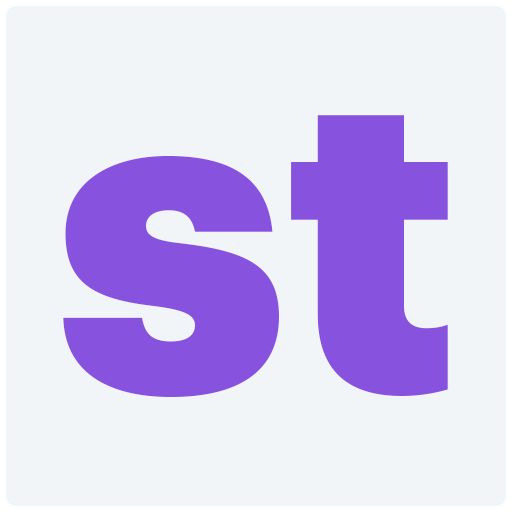
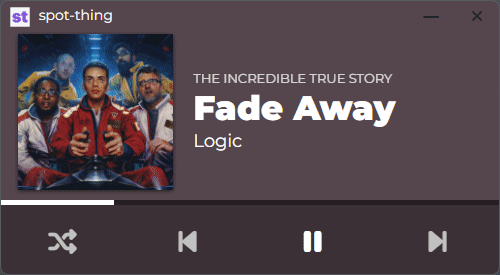
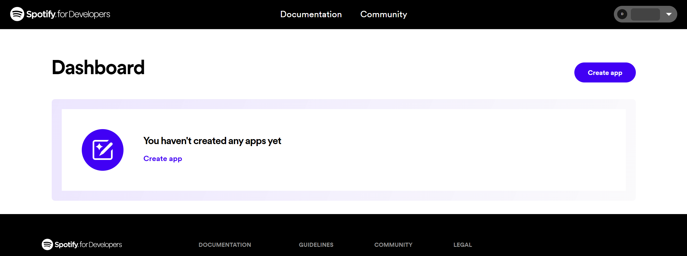
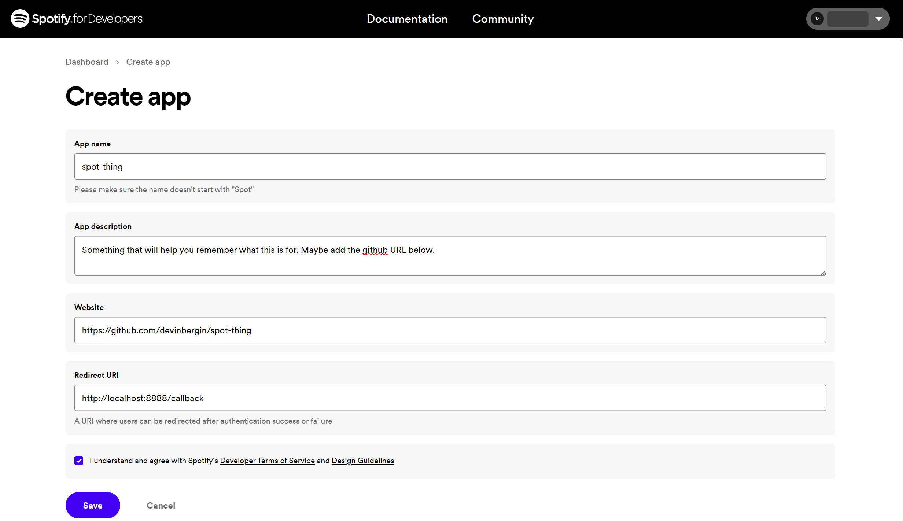
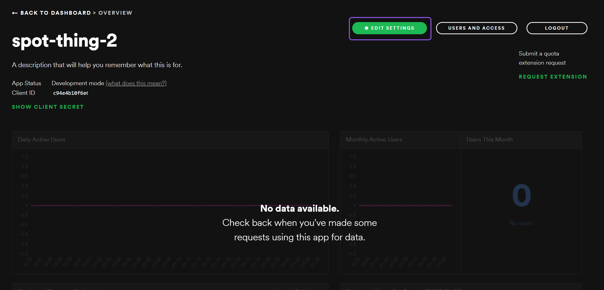
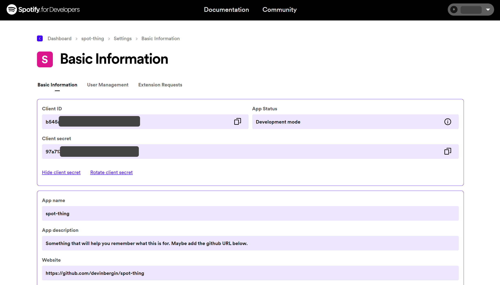
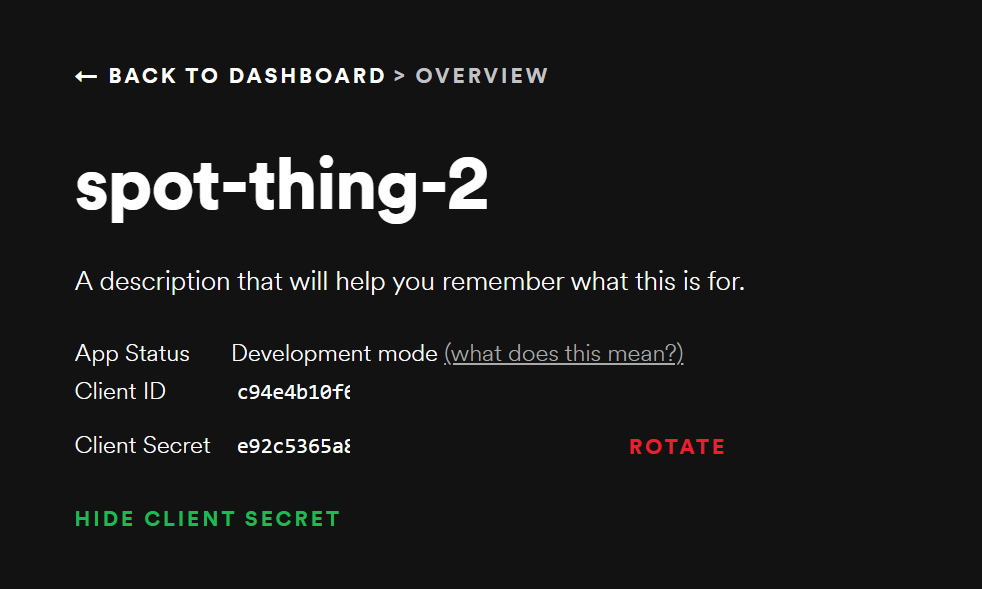
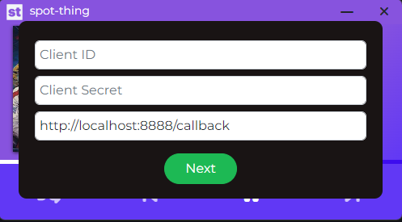
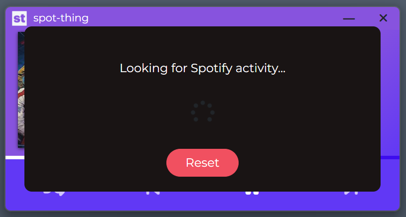
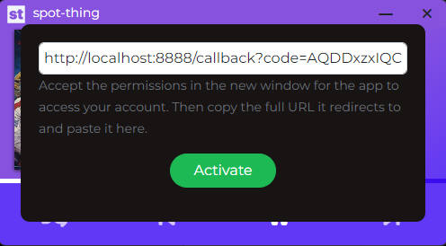

<div id="top"></div>

<!-- PROJECT LOGO -->
<br />
<div align="center">
  <a href="https://github.com/devinbergin/spot-thing">
    
  </a>

<h3 align="center">spot-thing</h3>

  <p align="center">
    A small player for spotify.
    <br />
    <a href="https://github.com/devinbergin/spot-thing"><strong>Explore the docs »</strong></a>
    <br />
    <br />
    <a href="https://github.com/devinbergin/spot-thing">View Demo</a>
    ·
    <a href="https://github.com/devinbergin/spot-thing/issues">Report Bug</a>
    ·
    <a href="https://github.com/devinbergin/spot-thing/issues">Request Feature</a>
  </p>
</div>


<!-- TABLE OF CONTENTS -->
<details>
  <summary>Table of Contents</summary>
  <ol>
    <li>
      <a href="#about-the-project">About The Project</a>
      <ul>
        <li><a href="#built-with">Built With</a></li>
      </ul>
    </li>
    <li>
      <a href="#getting-started">Getting Started</a>
      <ul>
        <li><a href="#prerequisites">Prerequisites</a></li>
        <li><a href="#installation">Installation</a></li>
      </ul>
    </li>
    <li><a href="#usage">Usage</a></li>
    <li><a href="#roadmap">Roadmap</a></li>
    <li><a href="#contributing">Contributing</a></li>
    <li><a href="#license">License</a></li>
    <li><a href="#contact">Contact</a></li>
    <li><a href="#acknowledgments">Acknowledgments</a></li>
  </ol>
</details>


<!-- ABOUT THE PROJECT -->
## About The Project

<p align="center">
  
</p>

I built spot-thing to be the spotify mini player experience on desktop that I always wanted. I tried several that are available and none really hit the mark for me. I saw the release of Car Thing and it looked like the perfect UI for a mini player. Debated grabbing one and popping it on my desk but instead, I decided to dive into my first Electron/Node JS application and build it myself. Which only took over a year because of my hobby fixations.

<p align="right">(<a href="#top">back to top</a>)</p>

### Built With

* [Electron](https://www.electronjs.org/)
* [Node.js](https://nodejs.org/)
* [Spotify Web API](https://developer.spotify.com/documentation/web-api/)
* [Bootstrap](https://getbootstrap.com)
* [JQuery](https://jquery.com)
* [Font Awesome](https://fontawesome.com/)

<p align="right">(<a href="#top">back to top</a>)</p>

<!-- -->
## For Users
**spot-thing is free to use! You can download the latest version [here](https://github.com/devinbergin/spot-thing/releases/download/v1/spot-thing.1.0.0.exe).**

After downloading the .exe file, place it somewhere you can access in the future, this is how you'll open spot-thing (or you can make a shortcut). Then follow the steps below.

### Getting Setup

To use spot-thing version 1, you need to setup your spotify developer account with a customer app. This will allow spot-thing to read information from your Spotify account.

1. Visit the Spotify Developer Dashboard below and login - [Spotfy Developer Dashboard](https://developer.spotify.com/dashboard/)
2. After logging in click the Create An App button in the top right corner
<p align="center">
  
</p>
3. In the window that opens, fill in the App Name (spot-thing) and App Description (something you choose) and click Create.
<p align="center">
  
</p>
4. The next page is the main area for your new app! Click the Edit Settings button in the upper right.
<p align="center">
  
</p>
5. Scroll down to where it says URI Redirects and copy and paste the URL below into the box. MAKE SURE TO CLICK ADD TO THE RIGHT OF THE FIELD. Then click save at the bottom. 
  ```sh
   http://localhost:8888/callback
  ```
<p align="center">
  
</p>
6. Now return to the main dashboard for your new app. In the upper left click to SHOW CLIENT SECRET and copy the Client ID and Client Secret. You will need these when you first open spot-thing. You shouldn't need them again as spot-thing will save them for you, but you can always access them in this dashboard in the future. 
<p align="center">
  
</p>
7. Now open spot-thing! 
8. You'll be prompted to enter your Client ID and Client Secret, then click Next. 
<p align="center">
  
</p>
9. When you click next, spot-thing will attempt to automatically open an authorization URL for you in your browser. This page is where you accept the permissions that spot-thing needs to read and control your playback details.
<p align="center">
  
</p>
10. After you click AGREE, you will be redirected to a blank page with a URL that begins with "http://localhost:8888/callback?code=" followed by a very long string. Copy the ENTIRE URL and paste it into spot-thing and click activate.
<p align="center">
  
</p>
11. You're done! If you have music currently playing on your spotify account you'll see spot-thing snap into action. If you don't have anything playing, you'll see a message from spot-thing to begin playing music on your main spotify app. spot-thing automatically stays connected to your account so you can close/open it as you need and you won't have to enter those details again. If for some reason it prompts you for the ID and Secret, just follow steps 8-11 again. 

<!-- GETTING STARTED -->
## For Developers

To get a local copy up and running follow these steps.

### Prerequisites

* NodeJS - Visit https://nodejs.org/en/download/ to get it installed
* Git - Visit https://git-scm.com/downloads to get it installed
* Spotify Premium Account

### Setup

To utilize the app you will need to create a Spotify App inside your Spotify Developer Dashboard. 

1. Visit xxx
2. Click here
3. Click there


### Installation

1. Clone the repo
   ```sh
   git clone https://github.com/devinbergin/spot-thing.git
   ```
2. Move into the new directory
   ```sh
   cd spot-thing
   ```
3. Install NPM packages
   ```sh
   npm install
   ```
4. Start the App!
   ```sh
   npm start
   ```
5. Enter your spotify app details in the forms. Once complete, begin playing your media from your main spotify controller.


<p align="right">(<a href="#top">back to top</a>)</p>


<!-- USAGE EXAMPLES -->
## Usage

Use this space to show useful examples of how a project can be used. Additional screenshots, code examples and demos work well in this space. You may also link to more resources.

### Working with scss

This project utilizes node-sass and scss files for compiled css. You will find several scss files containing the css code. 
- spot-thing.scss
- variables.scss
- fonts.scss
- style.scss

From a bash terminal, cd into he spot-thing folder and run this command
```sh
npm run scss
```

This will recompile the CSS file for you on each save while developing locally. 

You can also run a command to build the css if you prefer to use a minified version
```sh
npm run build-css
```

<p align="right">(<a href="#top">back to top</a>)</p>

### Building the app
```sh
npm run dist
```
