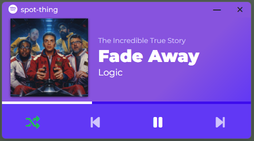

<div id="top"></div>

<!-- PROJECT LOGO -->
<br />
<div align="center">
  <a href="https://github.com/devinbergin/spot-thing">
    
  </a>

<h3 align="center">spot-thing</h3>

  <p align="center">
    A small player for spotify.
    <br />
    <a href="https://github.com/devinbergin/spot-thing"><strong>Explore the docs »</strong></a>
    <br />
    <br />
    <a href="https://github.com/devinbergin/spot-thing">View Demo</a>
    ·
    <a href="https://github.com/devinbergin/spot-thing/issues">Report Bug</a>
    ·
    <a href="https://github.com/devinbergin/spot-thing/issues">Request Feature</a>
  </p>
</div>


<!-- TABLE OF CONTENTS -->
<details>
  <summary>Table of Contents</summary>
  <ol>
    <li>
      <a href="#about-the-project">About The Project</a>
      <ul>
        <li><a href="#built-with">Built With</a></li>
      </ul>
    </li>
    <li>
      <a href="#getting-started">Getting Started</a>
      <ul>
        <li><a href="#prerequisites">Prerequisites</a></li>
        <li><a href="#installation">Installation</a></li>
      </ul>
    </li>
    <li><a href="#usage">Usage</a></li>
    <li><a href="#roadmap">Roadmap</a></li>
    <li><a href="#contributing">Contributing</a></li>
    <li><a href="#license">License</a></li>
    <li><a href="#contact">Contact</a></li>
    <li><a href="#acknowledgments">Acknowledgments</a></li>
  </ol>
</details>


<!-- ABOUT THE PROJECT -->
## About The Project

<p align="center">
  
</p>

I built spot-thing to be the spotify mini player experience on desktop that I always wanted. I tried several that are available and none really hit the mark for me. I saw the release of Car Thing and it looked like the perfect UI for a mini player. Debated grabbing one and popping it on my desk but instead, I decided to dive into my first Electron/Node JS application and build it myself. 

<p align="right">(<a href="#top">back to top</a>)</p>


### Built With

* [Electron](https://www.electronjs.org/)
* [Node.js](https://nodejs.org/)
* [Spotify Web API](https://developer.spotify.com/documentation/web-api/)
* [Bootstrap](https://getbootstrap.com)
* [JQuery](https://jquery.com)
* [Font Awesome](https://fontawesome.com/)

<p align="right">(<a href="#top">back to top</a>)</p>


<!-- GETTING STARTED -->
## Getting Started

To get a local copy up and running follow these steps.

### Prerequisites

* NodeJS - Visit https://nodejs.org/en/download/ to get it installed
* Git - Visit https://git-scm.com/downloads to get it installed
* Spotify Premium Account

### Setup

To utilize the app you will need to create a Spotify App inside your Spotify Developer Dashboard. 

1. Visit xxx
2. Click here
3. Click there


### Installation

1. Clone the repo
   ```sh
   git clone https://github.com/devinbergin/spot-thing.git
   ```
2. Move into the new directory
   ```sh
   cd spot-thing
   ```
3. Install NPM packages
   ```sh
   npm install
   ```
4. Start the App!
   ```sh
   npm start
   ```
5. Enter your spotify app details in the forms. Once complete, begin playing your media from your main spotify controller.


<p align="right">(<a href="#top">back to top</a>)</p>


<!-- USAGE EXAMPLES -->
## Usage

Use this space to show useful examples of how a project can be used. Additional screenshots, code examples and demos work well in this space. You may also link to more resources.

### Working with scss

This project utilizes node-sass and scss files for compiled css. You will find several scss files containing the css code. 
- spot-thing.scss
- variables.scss
- fonts.scss
- style.scss

From a bash terminal, cd into he spot-thing folder and run this command
```sh
npm run scss
```

This will recompile the CSS file for you on each save while developing locally. 

You can also run a command to build the css if you prefer to use a minified version
```sh
npm run build-css
```

<p align="right">(<a href="#top">back to top</a>)</p>

### Building the app
```sh
npm run dist
```
