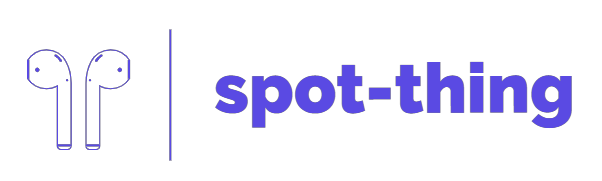

<div id="top"></div>

[![Contributors][contributors-shield]][contributors-url]
[![Forks][forks-shield]][forks-url]
[![Stargazers][stars-shield]][stars-url]
[![Issues][issues-shield]][issues-url]
[![MIT License][license-shield]][license-url]
[![LinkedIn][linkedin-shield]][linkedin-url]


<!-- PROJECT LOGO -->
<br />
<div align="center">
  <a href="https://github.com/devinbergin/spot-thing">
    
  </a>

<h3 align="center">spot-thing</h3>

  <p align="center">
    A small player for spotify.
    <br />
    <a href="https://github.com/devinbergin/spot-thing"><strong>Explore the docs »</strong></a>
    <br />
    <br />
    <a href="https://github.com/devinbergin/spot-thing">View Demo</a>
    ·
    <a href="https://github.com/devinbergin/spot-thing/issues">Report Bug</a>
    ·
    <a href="https://github.com/devinbergin/spot-thing/issues">Request Feature</a>
  </p>
</div>


<!-- TABLE OF CONTENTS -->
<details>
  <summary>Table of Contents</summary>
  <ol>
    <li>
      <a href="#about-the-project">About The Project</a>
      <ul>
        <li><a href="#built-with">Built With</a></li>
      </ul>
    </li>
    <li>
      <a href="#getting-started">Getting Started</a>
      <ul>
        <li><a href="#prerequisites">Prerequisites</a></li>
        <li><a href="#installation">Installation</a></li>
      </ul>
    </li>
    <li><a href="#usage">Usage</a></li>
    <li><a href="#roadmap">Roadmap</a></li>
    <li><a href="#contributing">Contributing</a></li>
    <li><a href="#license">License</a></li>
    <li><a href="#contact">Contact</a></li>
    <li><a href="#acknowledgments">Acknowledgments</a></li>
  </ol>
</details>


<!-- ABOUT THE PROJECT -->
## About The Project

[![Product Name Screen Shot][product-screenshot]](https://example.com)

I built spot-thing to be the spotify mini player experience on desktop that I always wanted. I tried several that are available and none really hit the mark for me. I saw the release of Car Thing and it looked like the perfect UI for a mini player. Debated grabbing one and popping it on my desk but instead, I decided to dive into my first Electron/Node JS application and build it myself. 

<p align="right">(<a href="#top">back to top</a>)</p>


### Built With

* [Electron](https://www.electronjs.org/)
* [Node.js](https://nodejs.org/)
* [Spotify Web API](https://developer.spotify.com/documentation/web-api/)
* [Bootstrap](https://getbootstrap.com)
* [JQuery](https://jquery.com)
* [Font Awesome](https://fontawesome.com/)

<p align="right">(<a href="#top">back to top</a>)</p>


<!-- GETTING STARTED -->
## Getting Started

This is an example of how you may give instructions on setting up your project locally.
To get a local copy up and running follow these simple example steps.

### Prerequisites

This is an example of how to list things you need to use the software and how to install them.
* NodeJS - Visit https://nodejs.org/en/download/ to get it installed
* Git - Visit https://git-scm.com/downloads to get it installed


### Installation

1. Get a free API Key at [https://example.com](https://example.com)
2. Clone the repo
   ```sh
   git clone https://github.com/devinbergin/spot-thing.git
   ```
3. Install NPM packages
   ```sh
   npm install
   ```
4. Enter your API in `config.js`
   ```js
   const API_KEY = 'ENTER YOUR API';
   ```

<p align="right">(<a href="#top">back to top</a>)</p>


<!-- USAGE EXAMPLES -->
## Usage

Use this space to show useful examples of how a project can be used. Additional screenshots, code examples and demos work well in this space. You may also link to more resources.

_For more examples, please refer to the [Documentation](https://example.com)_

<p align="right">(<a href="#top">back to top</a>)</p>


<!-- ROADMAP -->
## Roadmap

- [ ] Feature 1
- [ ] Feature 2
- [ ] Feature 3
    - [ ] Nested Feature

See the [open issues](https://github.com/devinbergin/spot-thing/issues) for a full list of proposed features (and known issues).

<p align="right">(<a href="#top">back to top</a>)</p>


<!-- CONTRIBUTING -->
## Contributing

Contributions are what make the open source community such an amazing place to learn, inspire, and create. Any contributions you make are **greatly appreciated**.

If you have a suggestion that would make this better, please fork the repo and create a pull request. You can also simply open an issue with the tag "enhancement".
Don't forget to give the project a star! Thanks again!

1. Fork the Project
2. Create your Feature Branch (`git checkout -b feature/AmazingFeature`)
3. Commit your Changes (`git commit -m 'Add some AmazingFeature'`)
4. Push to the Branch (`git push origin feature/AmazingFeature`)
5. Open a Pull Request

<p align="right">(<a href="#top">back to top</a>)</p>


<!-- LICENSE -->
## License

Distributed under the MIT License. See `LICENSE.txt` for more information.

<p align="right">(<a href="#top">back to top</a>)</p>


<!-- CONTACT -->
## Contact

Your Name - [@twitter_handle](https://twitter.com/twitter_handle) - email@email_client.com

Project Link: [https://github.com/devinbergin/spot-thing](https://github.com/devinbergin/spot-thing)

<p align="right">(<a href="#top">back to top</a>)</p>


<!-- ACKNOWLEDGMENTS -->
## Acknowledgments

* []()
* []()
* []()

<p align="right">(<a href="#top">back to top</a>)</p>


<!-- MARKDOWN LINKS & IMAGES -->
<!-- https://www.markdownguide.org/basic-syntax/#reference-style-links -->
[contributors-shield]: https://img.shields.io/github/contributors/devinbergin/spot-thing.svg?style=for-the-badge
[contributors-url]: https://github.com/devinbergin/spot-thing/graphs/contributors
[forks-shield]: https://img.shields.io/github/forks/devinbergin/spot-thing.svg?style=for-the-badge
[forks-url]: https://github.com/devinbergin/spot-thing/network/members
[stars-shield]: https://img.shields.io/github/stars/devinbergin/spot-thing.svg?style=for-the-badge
[stars-url]: https://github.com/devinbergin/spot-thing/stargazers
[issues-shield]: https://img.shields.io/github/issues/devinbergin/spot-thing.svg?style=for-the-badge
[issues-url]: https://github.com/devinbergin/spot-thing/issues
[license-shield]: https://img.shields.io/github/license/devinbergin/spot-thing.svg?style=for-the-badge
[license-url]: https://github.com/devinbergin/spot-thing/LICENSE.md
[linkedin-shield]: https://img.shields.io/badge/-LinkedIn-black.svg?style=for-the-badge&logo=linkedin&colorB=555
[linkedin-url]: https://linkedin.com/in/devinbergin
[product-screenshot]: images/currentUI.png
